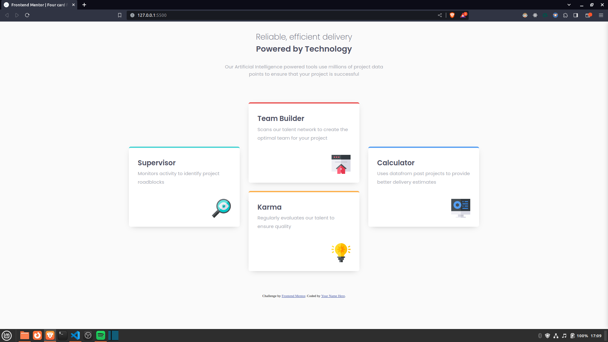

# Frontend Mentor - Four card feature section solution

This is a solution to the [Four card feature section challenge on Frontend Mentor](https://www.frontendmentor.io/challenges/four-card-feature-section-weK1eFYK). Frontend Mentor challenges help you improve your coding skills by building realistic projects. 

## Table of contents

- [Overview](#overview)
  - [The challenge](#the-challenge)
  - [Screenshot](#screenshot)
  - [Links](#links)
- [My process](#my-process)
  - [Built with](#built-with)
  - [What I learned](#what-i-learned)
- [Author](#author)

## Overview

### The challenge

Users should be able to:

- View the optimal layout for the site depending on their device's screen size

### Screenshot

### Links

- Solution URL: [solution](https://github.com/mondirhallouli/four-card-feature-section-fem)
- Live Site URL: [live site here](https://four-card-feature-section-fem.pages.dev/)

## My process

### Built with

- Semantic HTML5 markup
- CSS custom properties
- Flexbox
- Mobile-first workflow
- [SASS/SCSS](https://sass-lang.com/) - For styles
    - Mixins
    - Modules
    - Partials
    - Variables

### What I learned

This was a practice problem for me. I did not particularly learn new things, however, I had the chance to review some common practices such as BEM styling approach and semantic HTML layouts.

## Author

- Website - [my portfolio](https://www.mh-portfolio.pages.dev)
- Frontend Mentor - [@mondirhallouli](https://www.frontendmentor.io/profile/mondirhallouli)
- Github - [@mondirhallouli](https://www.github.com/mondirhallouli)
